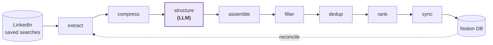

<p align="center">
  
</p>

<h1 align="center">Job Bunny</h1>

<p align="center">
  <em>A personal job-search companion that hops through LinkedIn every day,<br>
  filters &amp; ranks roles against your profile, and syncs the keepers to Notion.</em>
</p>

<p align="center">
  
  
  
</p>

---

## What it does

Job Bunny automates the tedious half of a job hunt. It opens your LinkedIn saved searches, scrapes the postings, structures the messy job descriptions into clean records, drops the noise (wrong location, wrong timezone, avoid-listed companies), deduplicates against what you've already seen, scores each role against your résumé, and writes the survivors into a Notion database you can track from anywhere.

**Notion is the source of truth.** Your manual tracking fields (status, notes, next action) are never touched — the pipeline only writes the automated columns.

## How it works



The guiding principle is **determinism**: filtering, dedup, and ranking are pure JavaScript, so the same input always yields the same output. The **only** runtime LLM step is `structure` — turning raw job-description text into schema-valid records. Ranking and filtering are never put behind a model.

A few other design choices worth calling out:

- **Config-driven scraping.** `extract.js` reads its selectors and behaviour from `page_inventory/<page>.md` at runtime. When LinkedIn changes its DOM, you fix one markdown file — no code regeneration.
- **Token-efficient LLM stage.** A pre-filter + compact markdown table (`compress.js`) and a markdown-table output format roughly halve the tokens the `structure` step spends versus raw JSON.
- **Notion as the mirror's master.** The profile's `cache.json` is just a performance mirror, rebuilt from the live Notion DB at the start of every run (`reconcile`), so cache drift can't accumulate.
- **Profiles (v0.7+).** All personal config lives in `profiles/<name>/` — resume, avoid list, filter keywords, search URLs, and a per-profile Notion page + database. Run the pipeline for any profile with `/run <name>`; plain `/run` uses the default from `config.json`. Profiles share one Chrome/LinkedIn session and one Notion token; note that search results are personalized to whichever LinkedIn account is logged in, so never copy account-specific URLs (like the *Recommended* collection) between profiles.

## The pipeline stages

| Stage | What it does |
|-------|--------------|
| `doctor` | Preflight — Chrome/CDP reachable, every page-type has an inventory, keys present |
| `reconcile` | Rebuild the profile's `cache.json` from its live Notion DB |
| `extract` | Playwright-over-CDP scraper — collect job cards + raw JD text |
| `compress` → `structure` → `assemble` | Pre-filter & compact → LLM structuring → merge back pass-through fields |
| `filter` | Drop wrong-location / incompatible-timezone roles |
| `dedup` | De-duplicate against what's already in Notion (by `job_id`) |
| `rank` | Deterministic 100-point résumé-match score + an excitement label |
| `sync` | Push new roles to Notion (automated fields only) |

In day-to-day use these run as [Claude Code](https://claude.com/claude-code) slash commands (`/run` drives the whole sequence; each stage is also standalone for debugging). The pure-JS stages are exposed as npm scripts too (`npm run filter`, `npm run rank`, …).

## Getting started

> Requires **Node ≥ 20**, a Chrome install, and a Notion integration token.

```bash
git clone https://github.com/Harish-here/job-bunny.git
cd job-bunny
npm install

# secrets
cp .env.example .env          # fill in your Notion token

npm run init <your-name>      # idempotent: scaffolds profiles/<your-name>/ + its Notion page & DB

# your resume (the real file is gitignored — keep it private)
cp resume.example.json profiles/<your-name>/resume.json   # then fill it in
JOBBUNNY_PROFILE=<your-name> npm run meta                  # derive resume_meta.json
```

`templates/cache.example.json` shows the shape of the run cache; the real cache is rebuilt from Notion on every run, so you never seed it by hand.

### Upgrading from ≤ 0.6.x

Nothing breaks when you pull: without a `config.json` the scripts keep using your existing root-level layout (legacy mode). When you're ready to switch to profiles:

1. If you edited `avoid.md`, `search_urls.md`, `filter_config.json`, or `resume_meta.json`, commit or back them up first — v0.7 stops tracking these files, so the pull may otherwise touch them.
2. `npm run migrate <your-name>` — moves your config into `profiles/<your-name>/`, adopts your existing Notion DB, and makes you the default profile. Anything the pull deleted is re-seeded from `templates/`.
3. Verify with `/doctor`.

Also note: the `filter` stage now reads your home city from `resume_meta.json` (previously hardcoded) — if you only ever ran `/filter` standalone, make sure that file exists (`npm run meta`). The old files remain in the repo's git history.

## Project layout

```
scripts/            deterministic pipeline stages (extract, filter, dedup, rank, sync …)
page_inventory/     per-page scraper config (selectors + behaviour, read at runtime; shared)
templates/          neutral seeds for new profiles (avoid list, filter config, search URLs)
profiles/<name>/    YOUR data (gitignored): resume, avoid.md, filter_config.json,
                    search_urls.md, profile.json (Notion ids), data/ (cache + run files)
.claude/commands/   Claude Code slash commands that drive the stages
resume.example.json resume template  →  copy into profiles/<name>/resume.json
config.json         (gitignored) { "default_profile": "<name>" } — created by init/migrate
CLAUDE.md           the run-time contract / agent guide
```

## Privacy

This repo ships **sanitized templates** only. Everything personal — your resume, avoid list, search URLs, filter keywords, Notion ids, and live job cache — lives under `profiles/` (gitignored) and never leaves your machine. Secrets live in `.env`, which is gitignored before any token is ever written.

---

<p align="center"><sub>A personal project — built and maintained with Claude Code. 🐰💜</sub></p>
