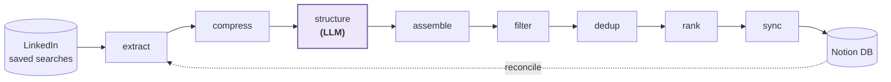

<p align="center">
  
</p>

<h1 align="center">Job Bunny</h1>

<p align="center">
  <em>A personal job-search companion that hops through LinkedIn every day,<br>
  filters &amp; ranks roles against your profile, and syncs the keepers to Notion.</em>
</p>

<p align="center">
  
  <a href="https://github.com/Harish-here/job-bunny/actions/workflows/test.yml"></a>
  
  
  
</p>

---

Job Bunny automates the tedious half of a job hunt. It opens your LinkedIn saved searches, scrapes the postings, structures the messy job descriptions into clean records, drops the noise (wrong location, wrong timezone, avoid-listed companies), deduplicates against everything you've already seen, scores each role against your résumé, and writes the survivors into a Notion database you can track from anywhere.

**Notion is the source of truth.** Your manual tracking fields (status, notes, next action) are never touched — the pipeline only writes the automated columns, and it rebuilds its local cache from Notion at the start of every run, so the two can never drift apart.

## Requirements

| | |
|---|---|
| **[Claude Code](https://claude.com/claude-code)** | The pipeline is driven by slash commands (`/run` and friends), and the one LLM step runs inline in the agent — **no separate API key needed** |
| **Node ≥ 20** | All deterministic stages are plain Node scripts — `/setup` checks this for you |
| **Chrome** | Scraping runs over Chrome DevTools Protocol against your real logged-in LinkedIn session |
| **Notion** | A workspace plus an [internal integration token](https://www.notion.so/my-integrations), shared with a page named **"Job Bunny's List"** |

On macOS, clone the repo somewhere *outside* `~/Desktop`, `~/Documents`, or `~/Downloads` — those folders are sandboxed from background `launchd` jobs, which silently breaks scheduled runs later (see [Troubleshooting](#troubleshooting)). `~/job-bunny` or `~/dev/job-bunny` are fine. `/setup` warns you if it detects this.

## Quick start

```bash
git clone https://github.com/Harish-here/job-bunny.git
cd job-bunny
```

Then open Claude Code in the repo and run:

```
/setup <your-name>   # one command: deps check, Notion page & DB, resume seeding, first URL, /doctor
/run                  # the whole pipeline; prints a run summary at the end
```

`/setup` walks you through everything end to end — collects your Notion integration token and confirms the shared root page up front, checks Node/Chrome/`npm install`, wires up your profile's Notion page + database, then **parses your résumé for you** (hand it a PDF, text file, or pasted text — it extracts the fields, asks one follow-up round for what a résumé can't tell it like home city/preferred work type, and shows a single summary to confirm) and derives `resume_meta.json`, **derives `filter_config.json`'s title-filter terms from your target roles** and shows you the result to confirm (the seeded default is frontend/UI-biased and will silently filter out everything for other domains if left as-is), asks for your first LinkedIn saved-search URL, offers optional Telegram notifications (`/notify-setup`), and finishes by running `/doctor` itself. `/doctor` launches Chrome with a persistent profile (`.chrome-debug/`, gitignored) — log in to LinkedIn once and the session is reused across every run.

<details>
<summary>Prefer no agent driving it? Manual/terminal-only path</summary>

```bash
npm install
cp .env.example .env          # fill in your Notion token
npm run init <your-name>      # scaffolds profiles/<your-name>/ + its Notion page & DB (idempotent)

# your resume — the real file is gitignored, it never leaves your machine
cp resume.example.json profiles/<your-name>/resume.json    # then fill it in
JOBBUNNY_PROFILE=<your-name> npm run meta                  # derive resume_meta.json
```

Then open Claude Code for `/add-url` (paste your saved-search URLs), `/doctor` (preflight), and `/run`.

</details>

## Daily use

One command: **`/run`** (or `/run <profile>` for a specific profile). It preflights, scrapes, structures, filters, ranks, syncs, and prints a summary — URLs processed, the extraction funnel, and a table of the top-scored roles. A stale LinkedIn selector skips that page-group and continues; it never kills the run.

Every stage is also a standalone command for re-runs and debugging:

| Command | What it does |
|---|---|
| `/doctor` | Preflight — Chrome/CDP reachable, page inventories present, cache valid, keys set |
| `/reconcile` | Rebuild the profile's `cache.json` from its live Notion DB |
| `/extract` | Playwright-over-CDP scraper — collect job cards + raw JD text |
| `/greenhouse` | Optional: keyless Greenhouse boards API lane — watchlist-driven, merges into the same raw text file |
| `/structure` | The one LLM step: raw JD text → schema-valid records (with checkpointing) |
| `/filter` | Drop wrong-location and incompatible-timezone roles |
| `/dedup` | De-duplicate against everything already in Notion (by `job_id`) |
| `/rank` | Deterministic 100-point résumé-match score + an excitement label |
| `/sync` | Push new roles to Notion — automated fields only, never your tracking columns |

And the maintenance kit:

| Command | What it does |
|---|---|
| `/add-url` | Add a saved-search URL — strips tracking/pagination params, files it under the right page-type |
| `/page-analyse` | LinkedIn changed its DOM? This inspects the live page and refreshes the scraper config |
| `/cleanup` | Archive Notion jobs marked *Passed* older than 7 days (dry-run by default; not part of `/run`) |
| `/update-resume` | Regenerate `resume_meta.json` after editing your resume |
| `/setup` | Guided onboarding — one command from a fresh clone to a running profile |

The pure-JS stages are exposed as npm scripts too (`npm run filter`, `npm run rank`, …) if you'd rather drive them from a plain terminal.

## How it works



**Channels.** LinkedIn (browser, discovery) is the primary channel — saved searches surface roles you haven't heard of. Greenhouse (`/greenhouse`, optional) is a second, keyless-API channel for *monitoring*: it watches a per-profile list of companies' Greenhouse boards (`profiles/<name>/greenhouse_boards.md`) that auto-grows from companies seen on LinkedIn cards, and merges any new postings into the same `jobs_raw_text.json` ahead of `/structure`. No watchlist, no browser — it's a no-op that exits cleanly.

Four design choices carry the project:

- **Determinism.** Filtering, dedup, and ranking are pure JavaScript — the same input always yields the same output, and a score is always explainable. The **only** runtime LLM step is `structure`, which turns raw job-description text into schema-valid records. Ranking and filtering are never put behind a model.
- **Config-driven scraping.** `extract.js` reads its selectors and behaviour from `page_inventory/<page>.md` at runtime. When LinkedIn changes its DOM, `/page-analyse` fixes one markdown file — no code changes, no regeneration.
- **Token-efficient LLM stage.** Avoid-listed companies are dropped before their JDs are ever opened; `compress.js` pre-filters by card title and hands the model a compact markdown table instead of JSON; the model answers in a markdown table too. Together that roughly halves what `structure` costs versus raw JSON in/out.
- **Profiles (v0.7+).** Everything personal lives in `profiles/<name>/` — resume, avoid list, filter keywords, search URLs, and a per-profile Notion page + database. `/run <name>` runs the pipeline for anyone; plain `/run` uses the default from `config.json`. Profiles share one Chrome/LinkedIn session and one Notion token — and because LinkedIn personalizes results to the logged-in account, account-specific URLs (like the *Recommended* collection) must never be copied between profiles.

## Configuration

Each profile is a folder of small, hand-editable files:

| File | Purpose |
|---|---|
| `resume.json` | Your résumé fields — seeded by `/setup` parsing a résumé you provide (or hand-edit it directly); the source the ranker scores against. `location` is a string or an array of strings if you have more than one home city |
| `resume_meta.json` | Derived from `resume.json` by `npm run meta` — home city/cities, skill sets |
| `avoid.md` | Companies to skip, with an alias map (matching normalizes both sides) |
| `filter_config.json` | Title keywords and filter tuning |
| `search_urls.md` | Your LinkedIn saved-search URLs, organized by page-type (managed by `/add-url`) |
| `profile.json` | The profile's Notion page + database ids (written by init, never by hand) |
| `data/` | Run cache + per-run intermediates — regenerated, never edited |

Useful environment overrides:

- `JOBBUNNY_PROFILE=<name>` — select a profile for any script (slash commands set this for you).
- `JOBBUNNY_WINDOW_HOURS=<n>` — widen the search window for one `/extract` (e.g. `48` after a missed day) without touching your stored URLs.

## Project layout

```
scripts/
  lib/              shared helpers — config (profile/path resolution), util
  pipeline/         deterministic stages (extract, greenhouse, compress, assemble, filter, dedup, rank)
  notion/           everything Notion — schema, cache/reconcile, sync, cleanup
  notify/           notification dispatcher + connectors (telegram)
  ops/              machine ops — doctor, schedule, run_scheduled.sh, run markers
  setup/            onboarding & profile maintenance — init, notify_setup, generate_meta, add_url
page_inventory/     per-page scraper config (selectors + behaviour, read at runtime; shared)
templates/          neutral seeds for new profiles (avoid list, filter config, search URLs)
profiles/<name>/    YOUR data (gitignored) — see Configuration above
.claude/commands/   the Claude Code slash commands that drive everything
resume.example.json resume template  →  copy into profiles/<name>/resume.json
config.json         (gitignored) { "default_profile": "<name>" } — created by init
CLAUDE.md           the agent's contract — rules Claude Code follows in this repo
```

## Troubleshooting

- **Extraction started missing jobs or failing an assertion** — LinkedIn shifted its DOM. Run `/page-analyse` for the affected page-type; it rewrites `page_inventory/<page>.md` from the live page and `/extract` picks it up on the next run.
- **Chrome or login problems** — run `/doctor`. It launches Chrome with the right debug flags and the persistent `.chrome-debug/` profile; if LinkedIn logged you out, log in once in that window.
- **Missed a day (or three)** — set `JOBBUNNY_WINDOW_HOURS=72` for one `/extract` (or `node scripts/pipeline/extract.js`) to widen the window for that run only.
- **`/sync` throws about a select option** — the option strings in `scripts/notion/schema.js` are byte-exact with the Notion DB. If you renamed an option in Notion, rename it back or update both sides together.
- **Notion filling up with passed jobs** — `/cleanup` archives *Passed* entries older than 7 days; it's dry-run until you confirm.
- **`/schedule` fails silently with `Operation not permitted` in `~/Library/Logs/JobBunny/*.err.log`, or a scheduled Chrome launch prompts for folder access with nobody there to click it** — macOS treats `~/Desktop`, `~/Documents`, and `~/Downloads` as protected folders; a background `launchd` job (unlike an interactive Terminal session) doesn't automatically get access to them, so both the shell script and Chrome itself can get silently blocked or hang waiting on a permission dialog. Keep the repo outside those three folders (e.g. `~/Job-bunny` or `~/dev/Job-bunny`) if you plan to use `/schedule` — it sidesteps the whole category of issue rather than granting access app-by-app.

## Upgrading from ≤ 0.6.x

The pre-0.7 root-level layout (legacy mode) and `/migrate` were removed. If you're on a pre-0.7 checkout, first check out tag `v1.1.0` and run `npm run migrate <your-name>` there to convert to the profiles layout, then upgrade and verify with `/doctor`.

## Privacy

This repo ships **sanitized templates** only. Everything personal — your resume, avoid list, search URLs, filter keywords, Notion ids, and live job cache — lives under `profiles/` (gitignored) and never leaves your machine. Secrets live in `.env`, which is gitignored before any token is ever written. The one LLM stage sees job-description text and card titles, not your resume.

## Contributing

`main` is protected — nothing lands on it directly. The flow:

1. **Branch off `main`**: `git checkout -b feat/<short-slug>` (or `fix/…`, `chore/…`, `docs/…` — same prefixes the commit history uses).
2. **Keep the suite green**: `npm test` locally; CI runs the same `node --test scripts/` on every pull request.
3. **Open a PR against `main`.** Small and focused beats big and sweeping — the pipeline's invariants live in [CLAUDE.md](CLAUDE.md) (deterministic stages stay deterministic, every script is explicit-input → explicit-output and fail-loud, Notion select strings are byte-exact).
4. Never commit anything personal: `profiles/`, `config.json`, and `.env` are gitignored for a reason — PRs should only ever touch code, templates, and docs.

Releases are cut by the maintainer via the `/wrap ship` flow: a short `release/vX.Y.Z` PR carrying the CHANGELOG block + version sync (package.json, README badge), auto-merged when CI is green, then the tag is pushed. Protection applies to admins too — nothing lands on `main` outside a PR.

## Changelog

See [CHANGELOG.md](CHANGELOG.md) for the release history.

---

<p align="center"><sub>A personal project — built and maintained with Claude Code. 🐰💜</sub></p>
